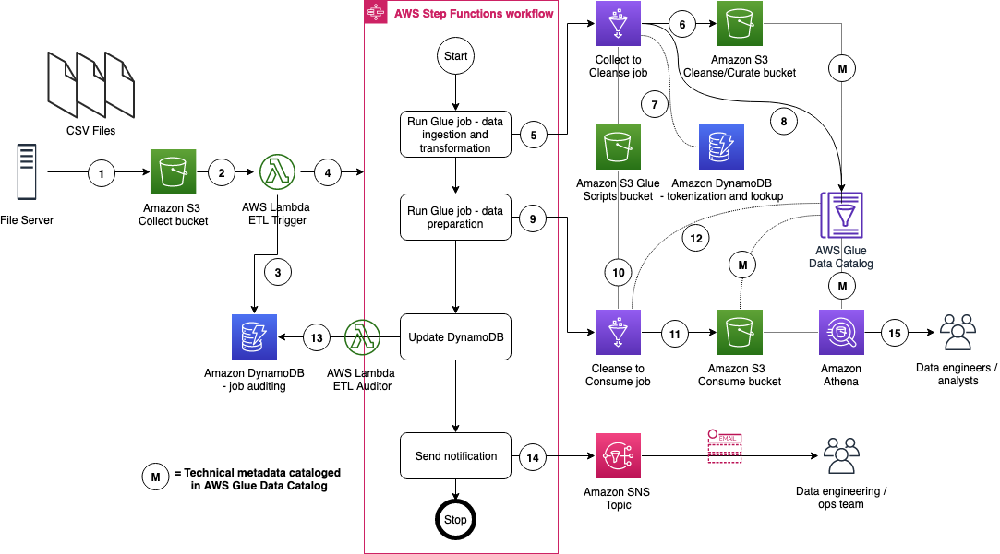

# InsuranceLake Architecture

In this section we talk about the overall InsuranceLake architecture and the ETL component.

## Contents

* [InsuranceLake](#insurancelake-3-cs)
* [ETL](#etl)

## InsuranceLake 3 Cs

As shown in the figure below, we use Amazon S3 for storage. We use three S3 buckets:
   1. Collect bucket to store raw data in its original format
   1. Cleanse/Curate bucket to store the data that meets the quality and consistency requirements of the lake
   1. Consume bucket for data that is used by analysts and data consumers of the lake (e.g. Amazon Quicksight, Amazon Sagemaker)

InsuranceLake is designed to support a number of source systems with different file formats and data partitions. To demonstrate, we have provided a CSV parser and sample data files for a source system with two data tables, which are uploaded to the Collect bucket.

We use AWS Lambda and AWS Step Functions for orchestration and scheduling of ETL workloads. We then use AWS Glue with pySpark for ETL and data cataloging, Amazon DynamoDB for transformation persistence, Amazon Athena for interactive queries and analysis. We use various AWS services for logging, monitoring, security, authentication, authorization, notification, build, and deployment.

**Note:** [AWS Lake Formation](https://aws.amazon.com/lake-formation/) is a service that makes it easy to set up a secure data lake in days. [Amazon QuickSight](https://aws.amazon.com/quicksight/) is a scalable, serverless, embeddable, machine learning-powered business intelligence (BI) service built for the cloud. [Amazon DataZone](https://aws.amazon.com/datazone/) is a data management service that makes it faster and easier for customers to catalog, discover, share, and govern data stored across AWS, on premises, and third-party sources. These three services are not used in this solution but can be added.

## ETL

The figure below represents the ETL resources we provision for the data lake.

1. A file server uploads files to S3 collect bucket of InsuranceLake; file server is a data producer/source for the data lake
2. Amazon S3 triggers an ObjectCreated event notification to AWS Lambda Function
3. AWS Lambda function inserts job information in DynamoDB table
4. AWS Lambda function starts an execution of AWS Step Functions State machine
5. Runs the first Glue job: initiates data processing from Collect to Cleanse
6. Glue job: Spark Glue job will process the data from Collect to Cleanse; source data is assumed to be in CSV format and will be converted to Parquet format
7. DynamoDB: Glue job tokenization will store original values, and lookup tables reside in database
8. After creating Parquet data, update the Glue Data Catalog table
9. Runs the second Glue job: initiates data processing from Cleanse to Consume
10. Glue job: Cleanse to Consume fetches data transformation rules from Glue scripts bucket, and runs transformations
11. Stores the result in Parquet format in Consume bucket
12. Glue job updates the Data Catalog table
13. Updates DynamoDB table with job status
14. Sends SNS notification
15. Data engineers or analysts analyze data using Amazon Athena

