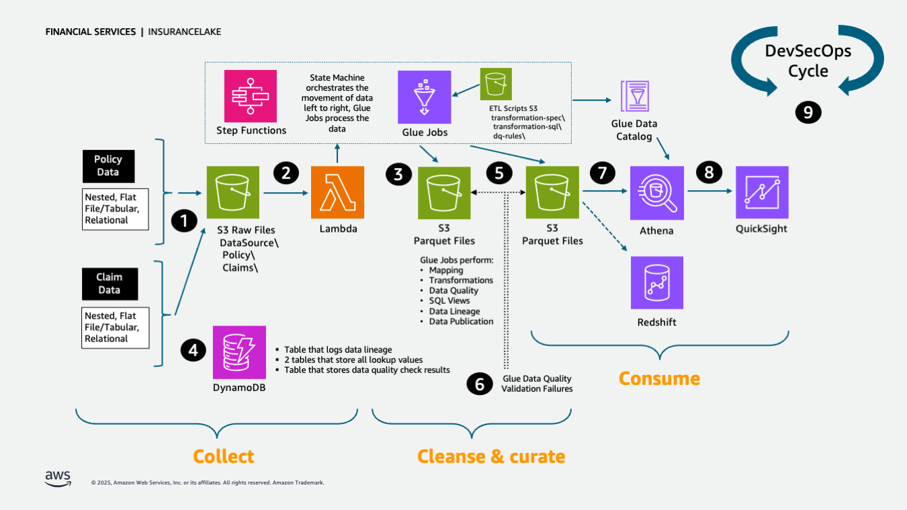

# InsuranceLake
{:.no_toc}

## Contents
{:.no_toc}

* TOC
{:toc}

## Overview

This solution guidance helps you deploy ETL processes and data storage resources to create InsuranceLake. It uses Amazon S3 buckets for storage, [AWS Glue](https://docs.aws.amazon.com/glue/) for data transformation, and [AWS CDK Pipelines](https://docs.aws.amazon.com/cdk/latest/guide/cdk_pipeline.html). The solution is originally based on the AWS blog [Deploy data lake ETL jobs using CDK Pipelines](https://aws.amazon.com/blogs/devops/deploying-data-lake-etl-jobs-using-cdk-pipelines/).

The InsuranceLake solution is comprised of two codebases: [Infrastructure](https://github.com/aws-solutions-library-samples/aws-insurancelake-infrastructure) and [ETL](https://github.com/aws-solutions-library-samples/aws-insurancelake-etl).

[CDK Pipelines](https://docs.aws.amazon.com/cdk/api/latest/docs/pipelines-readme.html) is a construct library module for painless continuous delivery of CDK applications. CDK stands for Cloud Development Kit. It is an open source software development framework to define your cloud application resources using familiar programming languages.

Specifically, this solution helps you to:

* Deploy a "3 Cs" (Collect, Cleanse, Consume) architecture InsuranceLake
* Deploy ETL jobs needed to make common insurance industry data souces available in a data lake
* Use pySpark Glue jobs and supporting resoures to perform data transforms in a modular approach
* Build and replicate the application in multiple environments quickly
* Deploy ETL jobs from a central deployment account to multiple AWS environments such as Dev, Test, and Prod
* Leverage the benefit of self-mutating feature of CDK Pipelines; specifically, the pipeline itself is infrastructure as code and can be changed as part of the deployment
* Increase the speed of prototyping, testing, and deployment of new ETL jobs

## Additional Resources

- [InsuranceLake Quickstart AWS Workshop](https://catalog.workshops.aws/insurancelake)
- [InsuranceLake Deep Dive AWS Workshop](https://catalog.us-east-1.prod.workshops.aws/workshops/0a85653e-07e9-41a8-960a-2d1bb592331b)
- [General Insurance dashboard](https://democentral.learnquicksight.online/#Dashboard-DashboardDemo-General-Insurance) on Quicksight's DemoCentral using Consume-ready-data
- [Life Insurance dashboard](https://democentral.learnquicksight.online/#Dashboard-DashboardDemo-Life-Insurance) also on Quicksight's DemoCentral
- [AWS Solutions Library Guidance for Modern Insurance Data Lakes](https://aws.amazon.com/solutions/guidance/modern-insurance-data-lakes-on-aws)
- [InsuranceLake in the AWS Well-Architected Framework Financial Services Industry Lens](https://docs.aws.amazon.com/wellarchitected/latest/financial-services-industry-lens/insurance-lake.html)

## Authors

The following people are involved in the design, architecture, development, testing, and review of this solution:

1. **Cory Visi**, Senior Solutions Architect, Amazon Web Services
1. **Ratnadeep Bardhan Roy**, Senior Solutions Architect, Amazon Web Services
1. **Isaiah Grant**, Cloud Consultant, 2nd Watch, Inc.
1. **Muhammad Zahid Ali**, Data Architect, Amazon Web Services
1. **Ravi Itha**, Senior Data Architect, Amazon Web Services
1. **Justiono Putro**, Cloud Infrastructure Architect, Amazon Web Services
1. **Mike Apted**, Principal Solutions Architect, Amazon Web Services
1. **Nikunj Vaidya**, Senior DevOps Specialist, Amazon Web Services

## Notices

Customers are responsible for making their own independent assessment of the information in this document. This document: (a) is for informational purposes only, (b) represents AWS current product offerings and practices, which are subject to change without notice, and (c) does not create any commitments or assurances from AWS and its affiliates, suppliers or licensors. AWS products or services are provided "as is" without warranties, representations, or conditions of any kind, whether express or implied. AWS responsibilities and liabilities to its customers are controlled by AWS agreements, and this
document is not part of, nor does it modify, any agreement between AWS and its customers.

## License Summary

This sample code is made available under the MIT-0 license. See the LICENSE file.

Copyright Amazon.com and its affiliates; all rights reserved. This file is Amazon Web Services Content and may not be duplicated or distributed without permission.