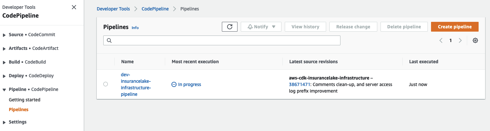
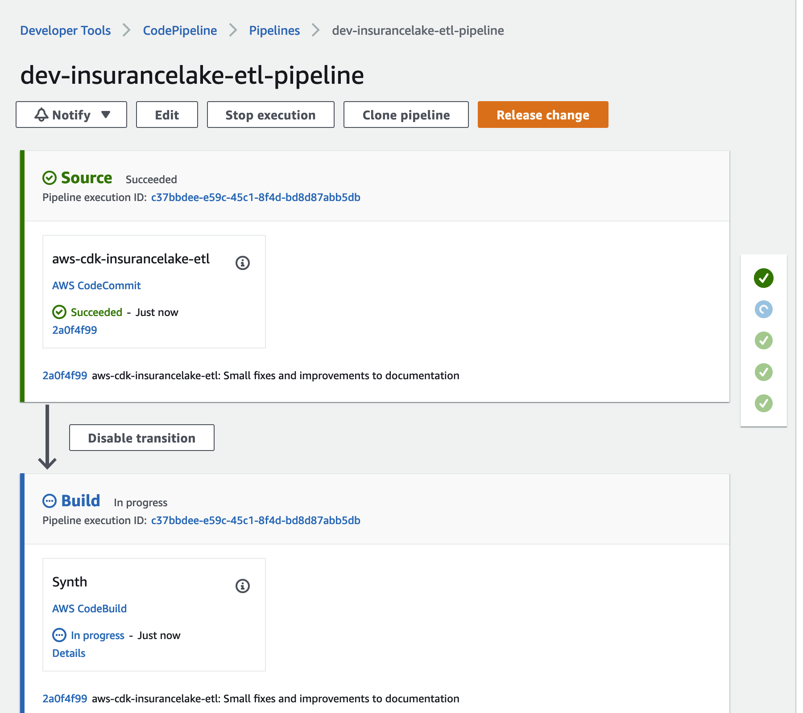

# InsuranceLake Quickstart with CI/CD Guide

## Deployment

If you've determined the AWS CDK InsuranceLake is a good starting point for your own InsuranceLake, and would like to rapidly iterate through development cycles with one or more teams, we recommend deploying with a CI/CD pipeline. Follow this guide to create your CodePipeline stack and to use it to deploy the InsuranceLake resources:

1. If this is your first time using the application, follow the [Python/CDK Basics](#pythoncdk-basics) steps
1. Use a terminal or command prompt and change the working directory to the location of the infrastruture code
    ```bash
    cd aws-insurancelake-infrastructure
    ```
1. In `lib/configuration.py`, review the `local_mapping` structure in the `get_local_configuration()` function
    - Specifically, the regions and account IDs should make sense for your environments. These values, in the repository (not locally), will be used by CodeCommit and need to be maintained in the repository.
    - The values for the Test and Production environments can be ommitted at this time, because we will only be deploying the Deployment and Development environments.
    - We want to explicitly specify the account and region for each deployment environment so that the infrastructure VPCs get 3 Availability Zones (if the region has them available). [Reference](https://docs.aws.amazon.com/cdk/api/v2/docs/aws-cdk-lib.aws_ec2.Vpc.html#maxazs)
1. Deploy CodeCommit repository stack
    ```bash
    cdk deploy Deploy-InsuranceLakeInfrastructureMirrorRepository
    ```
    - While this stack is designed for a mirror repository, it can also be used as a main repository for your InsuranceLake code. You can follow links to help setup other repository types here:
        - [Github](developer_guide.md#aws-codepipeline-and-github-integration)
        - [Bitbucket](https://complereinfosystem.com/2021/02/26/atlassian-bitbucket-to-aws-codecommit-using-bitbucket-pipelines/)
        - [Gitlab](https://klika-tech.com/blog/2022/07/12/repository-mirroring-gitlab-to-codecommit/)
1. If you plan to use CodeCommit as the main repository, [install the Git CodeCommit Helper](https://docs.aws.amazon.com/codecommit/latest/userguide/setting-up-git-remote-codecommit.html):
    ```bash
    sudo pip install git-remote-codecommit
    ```
1. Initialize git, create a develop branch, perform initial commit, and push to remote
    - We are using the develop branch because the Dev environment deployment is triggered by commits to the develop branch.
    - Edit the repository URL to correspond to your version control system if you are not using CodeCommit
    ```bash
    git init
    git branch -M develop
    git add .
    git commit -m 'Initial commit'
    git remote add origin codecommit::us-east-2://aws-insurancelake-infrastructure
    git push --set-upstream origin develop
    ```
1. Deploy Infrastructure CodePipeline resource in the development environment (1 stack)
    ```bash
    cdk deploy Dev-InsuranceLakeInfrastructurePipeline
    ```
1. Review and accept IAM credential creation for the CodePipeline stack
    - Wait for deployment to finish (approx. 5 mins)
1. Open CodePipeline in the AWS Console and select the `dev-insurancelake-infrastructure-pipeline` Pipeline
    - The first run of the pipeline starts automatically after the Pipeline stack is deployed.
    
1. Monitor the status of the pipeline until completed
    
1. Switch the working directory to the location of the etl code
    ```bash/
    cd ../aws-insurancelake-etl
    ```
1. In `lib/configuration.py`, review the `local_mapping` structure in the `get_local_configuration()` function, ensure this matches the Infrastructure configuration, or differs if specifically needed.
1. Deploy CodeCommit repository stack
    ```bash
    cdk deploy Deploy-InsuranceLakeEtlMirrorRepository
    ```
1. Initialize git, create a develop branch, perform initial commit, and push to remote
    - We are using the develop branch because the Dev environment deployment is triggered by commits to the develop branch.
    - Edit the repository URL to correspond to your version control system if you are not using CodeCommit
    ```bash
    git init
    git branch -M develop
    git add .
    git commit -m 'Initial commit'
    git remote add origin codecommit::us-east-2://aws-insurancelake-etl
    git push --set-upstream origin develop
    ```
1. Deploy ETL CodePipeline resource in the development environment (1 stack)
    ```bash
    cdk deploy Dev-InsuranceLakeEtlPipeline
    ```
1. Review and accept IAM credential creation for the CodePipeline stack
    - Wait for deployment to finish (approx. 5 mins)
1. Open CodePipeline in the AWS Console and select the `dev-insurancelake-etl-pipeline` Pipeline
    - The first run of the pipeline starts automatically after the Pipeline stack is deployed.
    
1. Monitor the status of the pipeline until completed
    