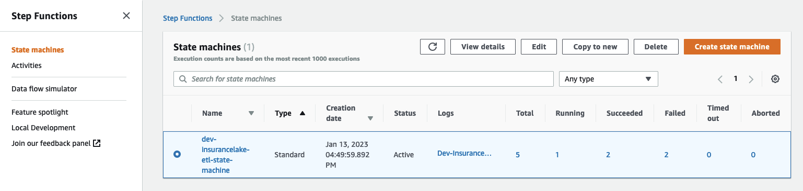

# InsuranceLake Quickstart Guide

## Contents

* [Python/CDK Basics](#pythoncdk-basics)
* [Deploy the Application](#deploy-the-application)
* [Try out the ETL Process](#try-out-the-etl-process)
* [Next Steps](#next-steps)

## Quickstart

If you'd like to get started quickly transforming some sample raw insurance data and running SQL on the resulting dataset, and without worrying about CI/CD, follow this guide.

### Python/CDK Basics

1. Open the AWS Console and navigate to [AWS Cloud9](https://console.aws.amazon.com/cloud9control/home)
1. Select the region to create the Cloud9 environment (should be the same region as the stack; us-east-2 by default)
1. Select Create environment
1. Enter an environment name, for example, InsuranceLakeDemo
1. Select the t3.small instance size (CDK deployment requires more than 1 GB RAM)
1. Leave the Platform selected as Amazon Linux 2023
1. Adjust the timeout to your preference
1. Click Create
1. Open the environment you created and wait until it is available for use
1. Clone the repositories
    ```bash
    git clone https://github.com/aws-solutions-library-samples/aws-insurancelake-infrastructure.git
    git clone https://github.com/aws-solutions-library-samples/aws-insurancelake-etl.git
    ```
1. Use a terminal or command prompt and change the working directory to the location of the _infrastructure_ code
    ```bash
    cd aws-insurancelake-infrastructure
    ```
1. Create a Python virtual environment
    ```bash
    python3 -m venv .venv
    ```
1. Activate the virtual environment
    ```bash
    source .venv/bin/activate
    ```
1. Install required Python libraries
    - NOTE: You may see a warning stating that a newer version is available; it is safe to ignore this for the Quickstart
    ```bash
    pip install -r requirements.txt
    ```
1. Bootstrap CDK in your AWS account
    - By default the solution will deploy resources to the `us-east-2` region
    ```bash
    cdk bootstrap
    ```

### Deploy the Application

1. Ensure you are still in the `aws-insurancelake-infrastructure` directory
1. Deploy infrastructure resources in the development environment (1 stack)
    ```bash
    cdk deploy Dev-InsuranceLakeInfrastructurePipeline/Dev/InsuranceLakeInfrastructureS3BucketZones
    ```
1. Review and accept IAM credential creation for the S3 bucket stack
    - Wait for deployment to finish (approx. 5 mins)
1. Copy the S3 bucket name for the Collect bucket to use later
    - Bucket name will be in the form: `dev-insurancelake-<AWS Account ID>-<Region>-collect`
1. Switch the working directory to the location of the _etl_ code
    ```bash
    cd ../aws-insurancelake-etl
    ```
1. Deploy the ETL resources in the development environment (4 stacks)
    ```bash
    cdk deploy Dev-InsuranceLakeEtlPipeline/Dev/InsuranceLakeEtlDynamoDb Dev-InsuranceLakeEtlPipeline/Dev/InsuranceLakeEtlGlue Dev-InsuranceLakeEtlPipeline/Dev/InsuranceLakeEtlStepFunctions Dev-InsuranceLakeEtlPipeline/Dev/InsuranceLakeEtlAthenaHelper
    ```
    - Wait for approximately 1 minute for DynamoDB deployment to finish
1. Review and accept IAM credential creation for the Glue jobs stack
    - Wait approximately 3 minutes for deployment to finish
1. Review and accept IAM credential creation for the Step Functions stack
    - Wait approximately 7 minutes for deployment of Step Functions and Athena Helper stacks to finish

### Try out the ETL Process

1. Populate the DynamoDB lookup table with sample lookup data
    ```bash
    AWS_DEFAULT_REGION=us-east-2 resources/load_dynamodb_lookup_table.py SyntheticGeneralData dev-insurancelake-etl-value-lookup resources/syntheticgeneral_lookup_data.json
    ```
1. Transfer the sample claim data to the Collect bucket
    ```bash
    aws s3 cp resources/syntheticgeneral-claim-data.csv s3://<Collect S3 Bucket>/SyntheticGeneralData/ClaimData/
    ```
1. Transfer the sample policy data to the Collect bucket
    ```bash
    aws s3 cp resources/syntheticgeneral-policy-data.csv s3://<Collect S3 Bucket>/SyntheticGeneralData/PolicyData/
    ```
1. Open [Step Functions](https://console.aws.amazon.com/states/home) in the AWS Console and select `dev-insurancelake-etl-state-machine`
    
1. Open the state machine execution in progress and monitor the status until completed
    
1. Open [Athena](https://console.aws.amazon.com/athena/home) in the AWS Console
1. Select Launch Query Editor, and change the Workgroup to `insurancelake`
1. Run the following query to view a sample of prepared data in the consume bucket:
    ```sql
    select * from syntheticgeneraldata_consume.policydata limit 100
    ```

### Next Steps

* Take the [InsuranceLake Deep Dive Workshop](https://catalog.us-east-1.prod.workshops.aws/workshops/0a85653e-07e9-41a8-960a-2d1bb592331b)
    * You may skip to the [Modify and test a transform](https://catalog.us-east-1.prod.workshops.aws/workshops/0a85653e-07e9-41a8-960a-2d1bb592331b/en-US/modify-a-transform) step, as the prior steps overlap with the Quickstart instructions
* Try out [loading your own data](loading_data.md#landing-source-data)
* Try the [Quickstart with CI/CD](#quickstart-with-cicd)
* Dive deeper with the included [user documentation](#contents)
* Contact your AWS account team for a solution deep dive, workshops, or Professional Services support