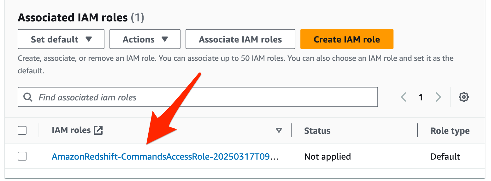
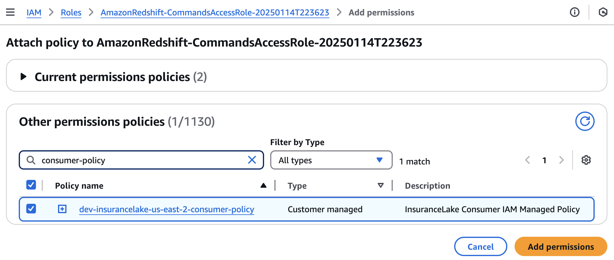

# Amazon Redshift Integration Guide
{: .no_toc }

This section provides instructions for configuring [Amazon Redshift](https://docs.aws.amazon.com/redshift/latest/mgmt/welcome.html) to query data in tables created by InsuranceLake and to enable InsuranceLake to create Amazon Redshift views of data lake data.


## Contents
{: .no_toc }

* TOC
{: toc }


## Setup

You can use an [Amazon Redshift cluster](https://docs.aws.amazon.com/redshift/latest/mgmt/working-with-clusters.html) or [Amazon Redshift Serverless](https://docs.aws.amazon.com/redshift/latest/mgmt/serverless-whatis.html) workgroup to directly query Data Catalog tables. You can optionally register databases in the Data Catalog created by InsuranceLake as Amazon Redshift external schemas, and create materialized views for improved query performance from Amazon Redshift's optimized compute engine.

Access to the data lake data from Amazon Redshift relies on [Amazon Redshift Spectrum](https://docs.aws.amazon.com/redshift/latest/dg/c-getting-started-using-spectrum.html#c-getting-started-using-spectrum-prerequisites), which requires that the workgroup or cluster be located in the same AWS Region.

If you need to create an Amazon Redshift Serverless workgroup or cluster, follow the respective getting started guides:
* [Get started with Amazon Redshift Serverless](https://docs.aws.amazon.com/redshift/latest/gsg/new-user-serverless.html)
* [Get started with Amazon Redshift provisioned](https://docs.aws.amazon.com/redshift/latest/gsg/new-user.html)


## Data Lake Permissions

Your Amazon Redshift workgroup or cluster must have the correct permissions to access the data lake. InsuranceLake deployment creates a customer-managed IAM policy that you can use to provide this access.

1. Identify the default IAM role used by the cluster or the workgroup's namespace in the [Amazon Redshift management console](https://console.aws.amazon.com/redshiftv2).
    

1. Select the IAM role name to open it in AWS Console.

1. Select `Add permissions`, then `Attach policies`.

1. Search for the InsuranceLake customer-managed policy, which follows the naming convention `<environment>-insurancelake-<region>-consumer-policy`, and select the checkbox to the left of the InsuranceLake.

    1. If you do not know the name of the policy, you can find it in the [CloudFormation console](https://console.aws.amazon.com/cloudformation).
    1. Select the InsuranceLake AWS Glue stack, `<Environment>-InsuranceLakeEtlGlue`.
    1. Select the `Outputs` tab.
    1. Find the value for the export named `<Environment>InsuranceLakeConsumerPolicy`. This is the customer-managed policy to attach.

1. Attach InsuranceLake customer-managed policy to the role by selecting `Add permissions`.

    {: .important }
    This policy grants the IAM role permissions to decrypt using the InsuranceLake KMS key, and read from InsuranceLake Amazon S3 buckets (Cleanse and Consume) and Data Catalog.

    


## Amazon Redshift Permissions

AWS Glue ETL jobs must have the correct permissions to access your Amazon Redshift resources and execute SQL statements. Follow the below steps to add these permissions to the IAM role used by ETL jobs by modifying the InsuranceLake AWS Glue stack.

1. Add the following policy document to `get_glue_role` starting at Line 502 in [glue_stack.py](https://github.com/aws-solutions-library-samples/aws-insurancelake-etl/blob/main/lib/glue_stack.py#L502), the InsuranceLake AWS Glue stack.

    {: .important}
    Modify the below code to use the correct ARN for your Amazon Redshift Serverless workgroup or cluster.
    ARNs for Amazon Redshift serverless workgroups follow the convention:
    `arn:aws:redshift-serverless:<REGION>:<ACCOUNT ID>:workgroup/<WORKGROUP UUID>`.
    ARNs for Amazon Redshift cluters follow the convention: `arn:aws:redshift:<REGION>:<ACCOUNT ID>:cluster:<CLUSTER ID>`.

    ```python
                    'RedshiftAccess':
                    iam.PolicyDocument(statements=[
                        iam.PolicyStatement(
                            effect=iam.Effect.ALLOW,
                            actions=[
                                'redshift-data:ExecuteStatement',
                                'redshift-data:BatchExecuteStatement',
                                'redshift-serverless:GetCredentials',
                            ],
                            resources=[
                                '<CLUSTER OR WORKGROUP ARN>',
                            ]
                        ),
                        iam.PolicyStatement(
                            effect=iam.Effect.ALLOW,
                            actions=[
                                'redshift-data:GetStatementResult',
                                'redshift-data:CancelStatement',
                                'redshift-data:DescribeStatement',
                            ],
                            resources=[ '*' ],
                            conditions={
                                'StringEquals': {
                                    'redshift-data:statement-owner-iam-userid': '${aws:userid}'
                                }
                            }
                        
                        ),
                    ]),
    ```

1. Using CDK, redeploy the AWS Glue stack.

    ```bash
    cdk deploy Dev-InsuranceLakeEtlPipeline/Dev/InsuranceLakeEtlGlue
    ```

1. Identify the IAM role for the InsuranceLake AWS Glue ETL jobs, which follows the naming convention `<environment>-insurancelake-<region>-glue-role`.

    1. If you do not know the name of the role, you can find it in the [CloudFormation console](https://console.aws.amazon.com/cloudformation).
    1. Select the InsuranceLake AWS Glue stack, `<Environment>-InsuranceLakeEtlGlue`.
    1. Select the `Outputs` tab.
    1. Find the value for the export named `<Environment>InsuranceLakeGlueRole`. This is the IAM role for AWS Glue ETL jobs.

1. Open the [Amazon Redshift query editor](https://console.aws.amazon.com/sqlworkbench/home#/client) as a superuser.

1. Run the following SQL to grant the InsuranceLake AWS Glue ETL jobs role access to your Amazon Redshift database and the Data Catalog through Amazon Redshift Spectrum.

    {: .note }
    In the below SQL, we explicitly create the Redshift user for the AWS Glue job IAM role so the `GRANT` statements succeed without having to run the ETL jobs once to create the user automatically (which would fail due to missing permissions).

    {: .important }
    Modify the below SQL statements to use the correct AWS Glue role name and Amazon Redshift database name.

    ```sql
    CREATE USER "IAMR:dev-insurancelake-us-east-2-glue-role" PASSWORD DISABLE;
    GRANT USAGE ON DATABASE "awsdatacatalog" TO "IAMR:dev-insurancelake-us-east-2-glue-role";
    GRANT CREATE ON DATABASE "dev" TO "IAMR:dev-insurancelake-us-east-2-glue-role";
    ```


## Configure database connection parameters

The Cleanse-to-Consume AWS Glue job requires extra parameters to create views in Amazon Redshift.

|Parameter Name     |Type   |Description
|---    |-- |--
|redshift_database  |Always required    |Database name
|redshift_workgroup_name    |Required for Amazon Redshift Serverless |Workgroup name
|redshift_cluster_id    |Required for Amazon Redshift provisioned    |Cluster ID

1. Prepare the set of parameters. Ensure the database, workgroup name, and cluster ID match the names in your environment.

    * For Amazon Redshift Serverless, use `redshift_database` and `redshift_workgroup_name`. Example follows.
        ```
        --redshift_database=dev
        --redshift_workgroup_name=default
        ```

    * For an Amazon Redshift provisioned cluster, use `redshift_database` and `redshift_cluster_id`. Example follows.
        ```
        --redshift_database=dev
        --redshift_cluster_id=redshift-cluster-1
        ```

1. Add two additional arguments to `glue_cleanse_task` starting at Line 164 in [step_functions_stack.py](https://github.com/aws-solutions-library-samples/aws-insurancelake-etl/blob/main/lib/step_functions_stack.py#L164), the InsuranceLake Step Functions stack.

    {: .note}
    AWS Glue job parameters can be specified in several ways: in a `StartJobRun` API call, SDK command, or CLI command; by modifying the AWS Glue ETL job parameters (under Job details, Advanced properties); and by modifying the task node `DevInsuranceLakeCleanseGlueJobTask` in the InsuranceLake Step Function State Machine definition. **We recommend modifying the Step Functions State Machine and using CDK to deploy the change.**

    {: .important}
    Modify the below example code to use the identified parameters from the prior step.

    This example is for an Amazon Redshift Serverless workgroup:
    ```python
            glue_cleanse_task = self.get_glue_job_task(
                'Cleanse', 'Cleanse to Consume data load and transform',
                cleanse_to_consume_job.name, failure_function_task,
                arguments={
                    '--source_database_name.$': '$.target_database_name',
                    '--target_database_name.$': "States.Format('{}_consume', $.target_database_name)",
                    '--base_file_name.$': '$.base_file_name',
                    '--redshift_database': 'dev',
                    '--redshift_workgroup_name': 'default',
                },
            )
    ```

1. Using CDK, redeploy the Step Functions stack.

    ```bash
    cdk deploy Dev-InsuranceLakeEtlPipeline/Dev/InsuranceLakeEtlStepFunctions
    ```


## Create an external schema

If you want to create materialized views in Amazon Redshift that use data lake data, follow these steps to create an external schema. **You must create an external schema for each data lake database you want to access.**

{: .warning}
Ensure you have successfully run a workflow to create each database before running these commands, or that you have manually created the databases. The Data Catalog database must exist for the commands to work.

1. Create an external schema based on the InsuranceLake database in the Data Catalog. This query creates an external schema `datalake_syntheticgeneraldata_consume`. The name following the `DATABASE` identifier must match the name of the Data Catalog database created by InsuranceLake.

    {: .note}
    For a full list of parameters refer to the [Create External Schema](https://docs.aws.amazon.com/redshift/latest/dg/r_CREATE_EXTERNAL_SCHEMA.html) documentation.

    ```sql
    CREATE EXTERNAL SCHEMA IF NOT EXISTS "datalake_syntheticgeneraldata_consume"
    FROM DATA CATALOG
    DATABASE 'syntheticgeneraldata_consume'
    IAM_ROLE DEFAULT;
    ```

1. Grant the AWS Glue role access to the external schema.

    {: .note}
    See the steps in [Amazon Redshift grants](#amazon-redshift-grants) to identify the correct IAM role name.

    ```sql
    GRANT USAGE ON SCHEMA "datalake_syntheticgeneraldata_consume" TO "IAMR:dev-insurancelake-us-east-2-glue-role";
    GRANT SELECT ON ALL TABLES IN SCHEMA "datalake_syntheticgeneraldata_consume" TO "IAMR:dev-insurancelake-us-east-2-glue-role";
    ```

1. Repeat these steps for other databases as needed.

For more details and examples of creating materialized views using the external schemas created above, see the [Amazon Redshift SQL](using_sql.md#amazon-redshift-sql) section of the InsuranceLake Cleanse-to-Consume SQL Usage Documentation.


## Query InsuranceLake

{: .note}
These instructions assume you have completed the [Quickstart guide](quickstart.md) and loaded the provided sample data into Data Catalog tables.

1. Access the [Amazon Redshift query console](https://console.aws.amazon.com/sqlworkbench/home#/client).

1. If you have just created your Redshift Serverless workgroup or cluster, you will be prompted for your connection method.
    1. Choose `Federated user` under `Other ways to connect`.
    1. Select `Create connection`.

1. In the tree-view pane, navigate to external databases under the `awsdatacatalog` schema. Notice the Data Catalog databases and tables like `syntheticgeneraldata` and `policydata`.

1. Run the following query.
    ```sql
    SELECT * FROM awsdatacatalog.syntheticgeneraldata_consume.policydata LIMIT 100;
    ```

Example queries using Amazon Redshift SQL:
* [Simple Amazon Redshift Materialized View](using_sql.md#simple-amazon-redshift-materialized-view)
* [Box Plot Amazon Redshift View](using_sql.md#box-plot-amazon-redshift-spectrum-view)


## Connect to Amazon Redshift - WORK IN PROGRESS

